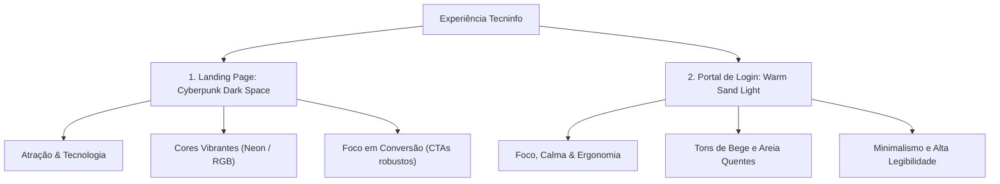

# 🎨 Manual do Sistema de Design (Design System) — Tecninfo

Este documento descreve as especificações técnicas, escolhas estéticas, tokens de design e componentes de estilo implementados no projeto **Tecninfo**. O projeto destaca-se por um modelo de **Tema Duplo (Dual-Theme)** estratégico, que equilibra a atração tecnológica na Landing Page e o foco ergonômico no Portal do Aluno.

---

## 🌓 Filosofia de Tema Duplo (Dual-Theme)

O projeto Tecninfo adota duas experiências estéticas contrastantes e complementares, projetadas sob medida para a jornada do usuário:



1. **Landing Page (Cyberpunk Dark Space):** Um tema escuro imersivo de ficção científica (deep space dark), projetado para criar impacto visual imediato, evocar modernidade extrema, tecnologia de ponta e engajar o público jovem de tecnologia.
2. **Área de Autenticação/Login (Warm Sand Light):** Um tema claro baseado em tons terrosos orgânicos (Sand/Bege). Oferece um contraste visual relaxante, focado em clareza, usabilidade ergonômica, tranquilidade e leitura prolongada para as tarefas administrativas do aluno.

---

## 🎨 1. Paleta de Cores e Tokens Visual

### A. Tema Escuro (Landing Page)
Idealizado com tons profundos de azul e cinza espacial, acentuados por cores neon elétricas em gradientes.

| Token de Variável | Cor Hexadecimal | Amostra | Função no Layout |
| :--- | :--- | :--- | :--- |
| `--bg-primary` | `#0b0f19` | ⬛ | Fundo geral do site (Deep Space Dark) |
| `--bg-secondary` | `#131b2e` | 🟦 | Fundo secundário e rodapé (Slate Dark Blue) |
| `--bg-card` | `rgba(22,30,49,0.7)` | 🟦 | Fundo translúcido de cartões com Glassmorphism |
| `--color-primary` | `#38bdf8` | 🟦 | Ciano Elétrico (Destaques, tags e botões primários) |
| `--color-secondary`| `#8b5cf6` | 🟪 | Roxo Neon (Gradientes e destaques secundários) |
| `--color-accent` | `#6366f1` | 🟪 | Índigo Cibernético (Bordas ativas e botões) |
| `--text-main` | `#f8fafc` | ⬜ | Texto principal em tom off-white suave |
| `--text-muted` | `#94a3b8` | ⬜ | Cinza Slate para textos secundários |
| `--border-color` | `rgba(255,255,255,0.08)` | ⬜ | Linhas de divisão e bordas translúcidas |

### B. Tema Claro (Warm Sand / Portal de Login)
Composto por tons de bege e areia quentes que reduzem a fadiga ocular, harmonizados com um tom espresso contrastante para leitura impecável.

| Token de Variável | Cor Hexadecimal | Amostra | Função no Layout |
| :--- | :--- | :--- | :--- |
| `--bg-page` | `#f9f6f0` | 🟨 | Fundo da página (Alabastro Quente / Areia Suave) |
| `--bg-card` | `#ffffff` | ⬜ | Fundo do formulário de login (Branco Puro para contraste) |
| `--bg-input` | `#fcfbfa` | ⬜ | Fundo dos campos de entrada |
| `--color-primary` | `#bf9a78` | 🟨 | Ouro do Deserto / Bronze Areia (Destaques e foco) |
| `--color-primary-dark`| `#8c6a4a` | 🟫 | Argila / Café Espresso (CTAs primários e textos de foco) |
| `--color-primary-light`| `#f4eae0` | 🟨 | Areia Iluminada (Fundos alternativos e hovers) |
| `--color-accent` | `#d48d57` | 🟧 | Terracota Suave (Acentos visuais pontuais) |
| `--text-main` | `#2b2721` | 🟫 | Cinza Café Profundo para máxima legibilidade |
| `--text-muted` | `#7c756c` | 🟫 | Cinza Terra para descrições secundárias |
| `--border-color` | `#ebdcc8` | 🟨 | Bordas finas nos tons de areia |

---

## font 2. Tipografia e Escala de Texto

O sistema tipográfico utiliza duas famílias de fontes do catálogo **Google Fonts** para combinar a precisão geométrica com um toque editorial moderno.

* **Família de Títulos e UI:** `'Plus Jakarta Sans'` (Landing Page) e `'Outfit'` (Login). Escolhidas por sua excelente largura de caracteres, geometria moderna e apelo minimalista.
* **Família de Leitura/Corpo:** `'Inter'`. A fonte sem serifa padrão ouro para interfaces digitais, com espaçamento e legibilidade exemplares em telas de alta densidade de pixels.

### Hierarquia de Tamanhos

```
h1.hero-title   ── 3.5rem (56px)  ── Linha de altura: 1.15 [Display Principal]
h1.login-title  ── 1.85rem (30px) ── Linha de altura: 1.2  [Títulos de Seção]
h2 / h3         ── 1.5rem (24px)  ── Peso: 700            [Títulos de Cartão]
body / input    ── 1.0rem (16px)  ── Peso: 400 ou 500     [Texto de Leitura]
labels / links  ── 0.88rem (14px) ── Peso: 600            [Ações Auxiliares]
error / tags    ── 0.78rem (12px) ── Peso: 700 / Bold     [Metadados / Alertas]
```

---

## ⚡ 3. Componentes e Elementos de Interface

### A. Botões Premium
1. **Botão Cyberpunk (`.btn-cyber-primary`):** 
   - Gradiente de fundo ativo (`#38bdf8` a `#6366f1`).
   - Pseudo-elemento `::before` que inverte o gradiente no hover com transição suave.
   - Sombra projetada de alta dispersão (`rgba(56, 189, 248, 0.3)`).
2. **Botão de Contraste Sand (`.btn-submit`):**
   - Cor sólida terrosa escura (`var(--color-primary-dark)`) para contraste imediato no fundo bege.
   - Transição física (`translateY(-2px)`) com expansão de sombra no foco.
   - Efeito de carregamento (*loading spinner*) integrado para sinalização assíncrona.

### B. Inputs Modernos com Floating Label
Implementados no formulário de login utilizando CSS avançado e seletores irmãos:
- O input tem um preenchimento superior generoso (`padding-top: 22px`) e um espaço reservado transparente (`placeholder=" "`).
- A etiqueta (`label.form-label`) é posicionada em cima do input.
- Usando o seletor `:focus` e `:not(:placeholder-shown)`, o CSS detecta interações do usuário e eleva o rótulo para o topo, reduzindo seu tamanho e alterando a cor para `#8c6a4a`:
```css
.form-input:focus ~ .form-label,
.form-input:not(:placeholder-shown) ~ .form-label {
  top: 15px;
  font-size: 0.75rem;
  font-weight: 600;
  color: var(--color-primary-dark);
}
```

### C. Efeito Glassmorphism
Aplicado no cabeçalho fixo e nos cartões da Landing Page:
```css
.bg-glass {
  background: rgba(22, 30, 49, 0.7);
  backdrop-filter: blur(12px);
  -webkit-backdrop-filter: blur(12px);
  border: 1px solid rgba(255, 255, 255, 0.08);
}
```
* **Vantagem:** Permite que as cores dos círculos decorativos flutuantes passem de forma embaçada pelo fundo, criando profundidade visual e senso de sofisticação 3D.

---

## 🌀 4. Efeitos e Micro-interações Dinâmicas

Para tornar a interface ativa e premium, o projeto implementa transições e animações de alta performance (aceleração por hardware).

### A. Dunas e Blobs Flutuantes
Os círculos brilhantes no tema escuro e as dunas orgânicas no tema claro utilizam gradientes radiais esfumaçados com `filter: blur(50px/80px)` e animações infinitas para preencher o fundo suavemente.

```css
@keyframes floatDune {
  0% { transform: translate(0, 0) rotate(0deg) scale(1); }
  100% { transform: translate(40px, 30px) rotate(15deg) scale(1.08); }
}
```

### B. Linha Ativa no Menu (Navbar Links)
Em vez de uma mudança de cor seca, os links de navegação possuem uma borda inferior estilizada que surge do centro para as extremidades usando escala vetorial (`transform: scaleX()`).
- O ponto de origem é invertido entre o início (`transform-origin: left`) e o fim (`transform-origin: right`) do hover para dar um efeito de "deslizamento".

### C. Ícone de Logo Flutuante
O logotipo na página de login utiliza uma animação de flutuação vertical cíclica (`@keyframes logoFloat`), proporcionando uma presença de marca sutil e atrativa.

---

## 🚀 5. Diretrizes para Futuras Estilizações

Ao criar novas páginas ou componentes para o projeto **Tecninfo**, siga estes princípios:
1. **Evite Cores Puras:** Nunca utilize pretos absolutos (`#000`), brancos puros em fundos extensos ou cores primárias do sistema (vermelho puro, azul puro). Opte pelas variáveis registradas.
2. **Priorize Transições Suaves:** Todas as ações de hover e foco em botões, links, cartões e campos de formulário devem utilizar tempos de transição entre `0.2s` e `0.4s` com curvas de aceleração cúbicas (ex: `cubic-bezier(0.25, 0.8, 0.25, 1)`).
3. **Respeite a Ergonomia Visual:** Se a tela pertencer a fluxos de trabalho extensos (painel do aluno, central de notas, exercícios de codificação), siga o padrão **Warm Sand** ou um tema escuro confortável. Se a tela for de captação e promoção, utilize o padrão **Cyberpunk Space**.
